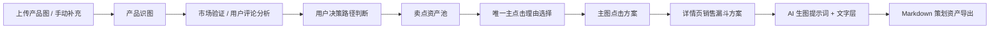
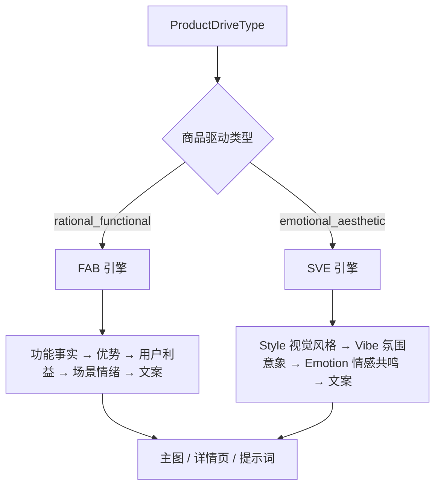
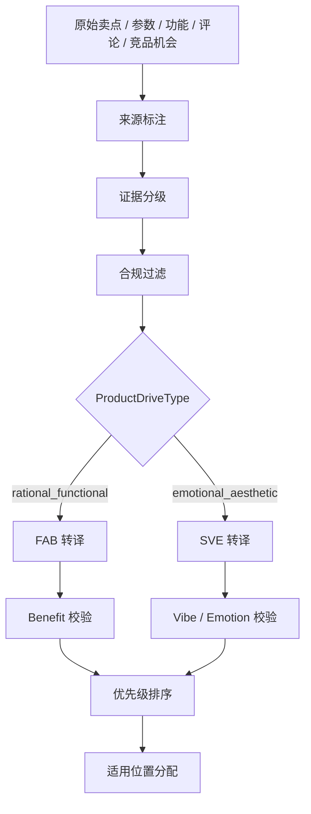
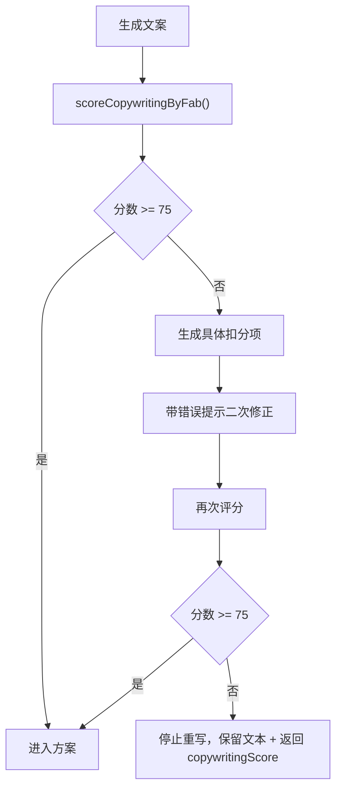

# AI视觉落地服务 / AI电商视觉策划助手：应用底层逻辑梳理

版本：2026-06-25  
用途：供产品负责人单独修改底层规则后，再反馈给 Codex 继续升级应用。  
边界：本文档描述当前应用的通用生成逻辑，不绑定任何具体品类、具体产品、具体案例文案。

---

## 0. 应用定位

本应用的目标不是直接生成图片，也不是简单生成漂亮页面，而是把用户上传的商品参考图、产品补充信息、竞品资料、用户评论资料，转成一套可落地的电商视觉策划资产。

应用本质是：

```txt
电商视觉策划资产生成器
```

禁止把应用定位成“图片生成器”。图片只是后续执行环节，当前应用真正要输出的是能指导点击、转化、文案、视觉和 AI 出图的策划资产。

最终输出必须服务于三个目标：

1. 提高主图点击率。
2. 提高详情页转化率。
3. 生成可执行的视觉方案、文案方案和 AI 出图提示词。

应用生成结果必须回答：

- 用户为什么会点这张主图。
- 用户为什么会继续看详情页。
- 用户看到哪一屏会产生购买理由。
- 用户的疑虑在哪一屏被解决。
- 哪些文案是基于事实、证据和用户利益生成的。
- 哪些视觉方案是为了点击和转化，而不只是为了好看。

当前主要交付资产包括：

1. 产品识图结果。
2. 市场验证、竞品拆解和用户评论洞察。
3. 用户决策路径。
4. 卖点资产池。
5. 唯一主点击理由。
6. 主图点击策略。
7. 详情页销售漏斗方案。
8. 本产品专属视觉风格体系。
9. AI 生图底图提示词和文字层。
10. Markdown 策划资产导出。

核心原则：

- 不把 AI 推断伪装成真实事实。
- 不把参数直接夸大成体验承诺。
- 不把内部模块名当作用户可见文案。
- 不让生图模型直接生成中文文字。
- 所有主图和详情页文案必须面向消费者利益，而不是复述产品字段。
- 主图必须解决“为什么点”。
- 详情页必须解决“为什么买”。
- 视觉方案必须服务点击和转化，不只追求好看。

---

## 1. 当前技术栈

项目路径：

```txt
/Users/vvv/Documents/产品设计/详情页策划页面
```

技术栈：

| 模块 | 当前使用 |
|---|---|
| 框架 | Next.js App Router |
| 语言 | TypeScript |
| UI | React + Tailwind CSS + 自定义 shadcn 风格组件 |
| 状态管理 | Zustand |
| 图标 | lucide-react |
| AI SDK | openai SDK + 自定义供应商适配器 |
| 桌面壳 | Electron |
| 样式 | Tailwind + `app/globals.css` + 品牌组件 |
| 导出 | 前端生成 Markdown 并下载 |

常用命令：

```bash
npm run dev
npm run build
npm run typecheck
npm run electron:dev
```

当前没有 `lint` script。

---

## 2. 顶层工作流

当前核心链路：



每一步不是孤立生成，而是逐层继承上游信息：

| 步骤 | 核心作用 | 主要输入 | 主要输出 |
|---|---|---|---|
| 上传 / 手动补充 | 建立原始素材和用户补充资料 | 图片、品名、品类、品牌、卖点、受众、备注 | 压缩图片、手动信息 |
| 产品识图 | 只看图提取基础事实 | 压缩图片、可选用户信息、AI 模型 | `ProductAnalysis` |
| 市场验证 / 用户评论分析 | 搜索、拆解或整理市场和用户资料 | 产品识图、竞品资料、评论资料、搜索配置 | `MarketResearch`、`CompetitorAnalysisResult`、`ReviewInsightResult` |
| 用户决策路径判断 | 判断用户从看到主图到下单的思考链路 | 产品、品类、市场、评论、受众 | `UserDecisionPath` |
| 视觉风格体系 | 反推视觉风格标准 | 产品识图、市场信息、用户补充 | `VisualStyleSystem` |
| 卖点资产池 | 把事实转成可分配卖点资产 | 产品、市场、评论、用户补充、证据 | `SellingPointAsset[]` |
| 唯一主点击理由选择 | 从 P0 卖点中选出首图唯一点击理由 | 卖点资产池、用户决策路径、证据等级 | `MainClickReason` |
| 主图点击方案 | 生成 5 张不同点击任务的主图策略 | 主点击理由、卖点资产、视觉风格 | `MainImagePlan[]` |
| 详情页销售漏斗方案 | 生成从吸引到转化的屏幕链路 | 用户决策路径、卖点资产、证据边界 | `DetailPageFunnelPlan[]` |
| 提示词生成 | 把方案转成生图提示词和文字层 | 方案、产品外观锚点、风格体系 | `GeneratedPrompt[]` |
| Markdown 导出 | 输出完整策划资产文档 | 当前所有结果、状态、来源、质检 | `.md` 文件 |

---

## 3. 核心数据来源与证据等级

### 3.1 信息来源

类型定义在：

```txt
lib/types.ts
```

```ts
export type InfoSource =
  | "image_fact"
  | "user_input"
  | "web_search"
  | "llm_inference"
  | "mock";
```

含义：

| 来源 | 含义 | 可用边界 |
|---|---|---|
| `image_fact` | 图片中可见或可读信息 | 可作为较强事实，但不能推断不可见参数 |
| `user_input` | 用户手动填写 | 可作为商家资料，但仍需合规处理 |
| `web_search` | 真实搜索或联网结果 | 可作为市场验证，需记录来源说明 |
| `llm_inference` | AI 基于上下文推断 | 只能作为弱表达或方向 |
| `mock` | 模拟数据 | 只用于演示，不可伪装成真实调研 |

### 3.2 证据等级

```ts
export type EvidenceLevel =
  | "S"
  | "A"
  | "B"
  | "C"
  | "forbidden";
```

| 等级 | 含义 | 使用规则 |
|---|---|---|
| S | 强事实，来源充分 | 可进入主图核心标题、详情页核心卖点 |
| A | 较可靠事实 | 可进入主图和详情页核心表达 |
| B | 中等可信事实 | 可进入主图或详情页，但表达需克制 |
| C | AI 推断或证据不足 | 只能作为场景、顾虑、表达方向 |
| forbidden | 禁止使用 | 不得进入主图、详情页、提示词和导出 |

下游规则：

- 主图核心标题只能使用 S / A / B 级信息。
- 详情页核心卖点只能使用 S / A / B 级信息。
- C 级信息只能作为场景、顾虑、语气方向，不得写成确定事实。
- forbidden 必须过滤。

---

## 4. 状态机与错误处理逻辑

状态管理文件：

```txt
lib/store.ts
```

### 4.1 全局状态

```ts
export type GlobalAnalysisStatus =
  | "idle"
  | "processing"
  | "partial_completed"
  | "completed"
  | "error";
```

### 4.2 步骤状态

```ts
export type StepStatus =
  | "idle"
  | "pending"
  | "success"
  | "failed";
```

步骤列表：

| step id | 对应模块 |
|---|---|
| `product` | 产品识图 |
| `research` | 市场验证 |
| `style` | 视觉风格体系 |
| `design` | 主图与详情页策划 |
| `prompts` | 提示词生成 |
| `export` | Markdown 导出 |

### 4.3 失败处理原则

1. 后续步骤失败，不清空已完成数据。
2. 市场验证失败后，产品识图仍保留。
3. 提示词失败后，主图和详情页方案仍可查看。
4. 用户可以单步重试失败步骤。
5. 只有产品识图失败且没有基础产品档案时，才阻断后续流程。

### 4.4 数据暂存与崩溃防御

工作流状态需要建立本地实时持久化闭环，避免浏览器刷新、Electron 壳异常退出或单步 API 失败导致全盘数据丢失。

建议落点：

```txt
lib/store.ts
```

机制：

1. 用户每完成一个输入字段，立即写入 LocalStorage 或 IndexedDB。
2. 每个工作流步骤成功后，立即保存该步骤输出和步骤状态。
3. 页面重新打开时，从本地缓存恢复最近一次项目状态。
4. 用户主动点击“重置”时，才清空本地暂存。
5. 暂存数据需要包含版本号，后续字段结构变化时可以做兼容迁移。

持久化范围：

- 上传图片预览引用和压缩后分析图。
- 手动补充信息。
- 产品识图结果。
- 市场验证结果或用户粘贴的市场资料。
- 视觉风格体系。
- 主图与详情页方案。
- 提示词结果。
- 各步骤状态、错误信息、重试次数。

边界：

- API Key 不落盘到项目数据里。
- 可敏感的用户素材只保存在本机，不上传第三方存储。
- 本地暂存只作为恢复机制，不等同于数据库。

---

## 5. 上传与手动补充模块

相关文件：

```txt
components/upload/ProductUploader.tsx
lib/store.ts
lib/config.ts
```

### 5.1 信息获取逻辑

用户可以提供：

- 多张产品图。
- 产品名称。
- 品类。
- 品牌。
- 已知卖点。
- 目标受众。
- 商品驱动类型 `ProductDriveType`。
- 其他备注。

其中 `ProductDriveType` 是手动补充模块的必选项，用来决定后续策划引擎走“理性功能转化”还是“感性美学转化”。

```ts
export type ProductDriveType =
  | "rational_functional"
  | "emotional_aesthetic";
```

| 类型 | 含义 | 典型品类 |
|---|---|---|
| `rational_functional` | 理性功能型，用户更关注功能、参数、效果、解决问题能力 | 小家电、数码、功效护肤、工具类产品 |
| `emotional_aesthetic` | 感性美学型，用户更关注风格、氛围、身份表达、审美共鸣 | 服饰、潮玩、创意文创、香水、礼品类产品 |
 
分流原则：

1. `rational_functional` 走标准 FAB 引擎：功能事实 → 产品优势 → 用户利益 → 场景情绪 → 上屏文案。
2. `emotional_aesthetic` 停用标准 FAB 强转译，切换为 SVE 引擎：Style 视觉风格 → Vibe 氛围意象 → Emotion 情感共鸣。
3. 若用户未选择，界面应提示补充；若必须自动兜底，默认仅作为临时 `rational_functional`，并在结果中提示“商品驱动类型未确认”。

图片逻辑：

1. 原图只用于前端预览。
2. 发给 API 前压缩。
3. 最长边不超过 1024px。
4. 优先 WebP 或 JPEG。
5. 质量约 0.8 到 0.85。
6. 单张建议不超过 500KB。
7. 请求体超限时返回明确错误。

### 5.2 信息组织逻辑

上传图片变成：

```ts
UploadedProductImage[]
```

手动信息变成：

```ts
ProductManualInfo
```

其中应包含：

```ts
productDriveType: ProductDriveType
```

### 5.3 输出逻辑

上传模块不直接生成策划，只负责提供：

- `analysisUrl`：压缩后给 AI 识图用。
- `previewUrl`：前端预览用。
- `manualProductInfo`：下游补充资料。

---

## 6. 产品识图模块

API：

```txt
POST /api/analyze-product
```

服务：

```txt
lib/services/analyze-product-image.ts
```

### 6.1 输入

```ts
{
  images?: UploadedProductImage[];
  imageBase64?: string;
  imageUrl?: string;
  manualProductInfo?: ProductManualInfo;
  providerConfig?: AIProviderConfig;
}
```

### 6.2 前置校验

在 API route 中校验：

- 请求体大小。
- 当前模型是否支持视觉识别。
- API Key 和供应商配置是否可用。

若模型不支持 vision：

```txt
当前模型不支持图片识别，请换用支持视觉理解的模型。
```

### 6.3 信息获取逻辑

产品识图只应基于：

1. 上传图片可见信息。
2. 图片中文字。
3. 手动补充信息。
4. 模型对外观的视觉理解。

禁止：

- 编造不可见参数。
- 把推断当成确定事实。
- 把 C 级推断写成强卖点。

### 6.4 输出结构

核心类型：

```ts
ProductAnalysis
```

主要字段：

| 字段 | 含义 |
|---|---|
| `category` | 产品品类 |
| `productNameGuess` | 产品名称猜测 |
| `appearance` | 外观结构 |
| `visibleFeatures` | 可见功能点 |
| `materials` | 材质判断 |
| `colors` | 颜色 |
| `styleKeywords` | 视觉关键词 |
| `risks` | 识别风险 |
| `brandNames` | 中英文品牌名 |
| `brandVisualStyle` | 品牌视觉风格 |
| `specifications` | 规格信息 |
| `sellingPoints` | 图片可见卖点 |
| `dataSellingPoints` | 图片可见数据卖点 |
| `targetAudience` | 初步目标人群 |
| `parameters` | 图片可见参数 |
| `productDetails` | 产品细节 |
| `specialRequirements` | 特殊需求建议 |
| `visualStyleSystem` | 第一轮视觉风格线索 |
| `visualAnchor` | 产品外观锚点 |
| `evidence` | 字段来源和证据等级 |

### 6.5 产品外观锚点

服务：

```txt
lib/services/product-visual-anchor.ts
```

类型：

```ts
ProductVisualAnchor
```

作用：

- 锁定产品品类形态。
- 锁定主色和辅色。
- 锁定材质观感。
- 锁定关键部件。
- 明确必须保持和必须避免。

下游用途：

- 注入所有 `backgroundPrompt` 开头。
- 防止多张主图和多屏详情页产品形态漂移。

---

## 7. 市场验证模块

API：

```txt
POST /api/research-product
```

服务：

```txt
lib/services/ai.ts
lib/services/product-search.ts
```

### 7.1 输入

```ts
{
  productAnalysis: ProductAnalysis;
  manualProductInfo?: ProductManualInfo;
  providerConfig?: AIProviderConfig;
  searchProviderConfig?: SearchProviderConfig;
}
```

### 7.2 信息获取逻辑

优先级：

1. 真实搜索结果。
2. AI 供应商内置联网能力。
3. 用户粘贴的竞品文案 / 用户评论 / 平台截图 OCR 文本。
4. Mock 模式使用模拟数据。
5. AI 推断只能作为市场框架提示，不得直接激活真实市场验证。

关键边界：

- 没有真实搜索结果时，不得伪装成真实竞品调研。
- 没有搜索 Key 或搜索结果时，不能直接降级为弱推断并继续强行生成 P0 市场卖点。
- 前端应提供“竞品文案 / 用户评论直接粘贴”或图片 OCR 导入区域，让用户补充可用市场资料。
- 用户粘贴的竞品文案、评论、平台详情页片段或 OCR 导入内容，标记为 `user_input`，在当前项目内视作 A 级事实证据。
- 这类 A 级证据可以激活下游 P0 卖点池，但仍需做合规过滤、去重、去平台夸张话术和参数边界检查。
- 没有搜索结果且没有用户补充市场资料时，市场结论最高只能是 C 级。
- 真实平台排名、销量、评价原文、价格带不能由 AI 编造。

市场验证兜底输入的组织方式：

```txt
用户粘贴竞品文案 / 评论 / OCR 文本
→ 清洗平台噪音
→ 提取卖点、痛点、疑问、标题风格
→ 标记 user_input + EvidenceLevel A
→ 合规与参数边界过滤
→ 进入卖点资产池
```

注意：

- “用户粘贴内容为 A 级证据”只代表这是用户提供的可用资料，不代表其内容天然真实、合规或可直接上屏。
- 如果粘贴内容包含极限词、虚假销量、竞品贬损、医疗化承诺，仍必须过滤或降级。

### 7.3 信息组织逻辑

核心类型：

```ts
MarketResearch
```

主要字段：

| 字段 | 含义 |
|---|---|
| `hotSellingPoints` | 热门卖点 |
| `userPainPoints` | 用户痛点 |
| `userFeedbackPros` | 用户反馈优点 |
| `userFeedbackCons` | 用户反馈问题 |
| `copywritingSellingPoints` | 文案卖点 |
| `certificationSellingPoints` | 认证卖点 |
| `featureSellingPoints` | 特征卖点 |
| `dataSellingPointInsights` | 数据卖点 |
| `userQuestions` | 用户常见疑问 |
| `aiShoppingInsights` | AI 购物助手推荐逻辑 |
| `targetUserProfiles` | 目标用户画像 |
| `functionProblemMapping` | 功能到问题解决映射 |
| `targetAudienceInsights` | 目标受众推断 |
| `productParameterInsights` | 产品参数提取 |
| `productDetailInsights` | 产品细节识别 |
| `designStyleJudgement` | 设计风格判断 |
| `competitorTitleStyles` | 竞品标题风格 |
| `visualStyles` | 视觉风格方向 |
| `competitorVisualBenchmarks` | 竞品视觉标杆 |
| `designStrategyNotes` | 设计策略笔记 |
| `evidence` | 来源和证据等级 |
| `sourceNote` | 搜索或推断说明 |

### 7.4 输出逻辑

市场验证输出不直接成为文案，而是进入：

1. 视觉风格体系。
2. 卖点资产池。
3. 用户画像和决策链路。
4. 主图 / 详情页策划。
5. Markdown 来源声明。

### 7.5 竞品拆解与用户评论分析模块

应用要支持品牌做爆款详情页策划，因此竞品拆解和用户评论分析应成为正式输入模块，而不是市场验证里的弱描述。

建议新增服务：

```txt
lib/services/competitor-analysis.ts
lib/services/review-insight.ts
```

新增输入能力：

1. 竞品链接或竞品文案粘贴。
2. 竞品主图上传。
3. 用户评论文本粘贴。
4. 平台截图 OCR 文本导入。
5. 手动输入价格带、销量区间、目标平台。

竞品拆解目标：

- 支持 20 到 50 个竞品。
- 提取主图视觉规律。
- 提取标题高频词。
- 提取卖点表达方式。
- 提取价格带。
- 提取信任背书方式。
- 提取差异化机会。

用户评论分析目标：

- 支持 1000+ 评论文本。
- 提炼 TOP5 购买理由。
- 提炼 TOP10 用户痛点。
- 提炼用户顾虑。
- 提炼用户评价词云。
- 提炼卖点词云。
- 提炼价格敏感点。
- 提炼真实使用场景。

输出结构建议：

```ts
export interface CompetitorAnalysisResult {
  competitorCount: number;
  mainImagePatterns: string[];
  titleKeywordLibrary: string[];
  sellingPointPatterns: string[];
  pricePositionMap: Array<{
    priceRange: string;
    commonSellingPoints: string[];
    visualStyle: string;
  }>;
  differentiationOpportunities: string[];
  evidenceNote: string;
}

export interface ReviewInsightResult {
  reviewCount: number;
  topPurchaseReasons: string[];
  topPainPoints: string[];
  userConcerns: string[];
  usageScenarios: string[];
  positiveKeywords: string[];
  negativeKeywords: string[];
  sellingPointWordCloud: string[];
  reviewWordCloud: string[];
  conversionOpportunities: string[];
}
```

边界：

- 如果没有真实竞品和评论资料，不得伪造“销量前 100”“1000+ 评论”。
- 如果用户只上传少量资料，必须显示“样本有限”。
- 评论原文中出现极端词、违规承诺、医疗化表达时，必须清洗后才能进入文案资产池。
- 竞品资料只能用于观察市场表达和差异机会，不得直接抄袭竞品文案。
- 竞品对比不得攻击竞品，只突出自身可证实优势。

下游关系：

```txt
竞品拆解 + 评论分析
→ 用户决策路径
→ 卖点资产池
→ 唯一主点击理由
→ 主图点击策略 / 详情页销售漏斗
```

---

## 8. 视觉风格体系模块

API：

```txt
POST /api/generate-visual-style
```

服务：

```txt
lib/services/generate-visual-style-system.ts
```

### 8.1 输入

- 产品识图结果。
- 市场验证结果。
- 手动补充信息。

### 8.2 核心目标

根据产品属性、品类属性、市场视觉方向，反推本产品专属电商视觉风格体系。

固定六大模块：

1. 整体调性。
2. 画面质感。
3. 布光逻辑。
4. 色彩体系。
5. 字体规范。
6. 构图规范。

当前还会补充：

- 产品外观特征。
- 统一视觉风格。

### 8.3 输出结构

```ts
VisualStyleSystem
```

字段：

| 字段 | 含义 |
|---|---|
| `overallTone` | 整体调性 |
| `imageTexture` | 画面质感 |
| `lightingLogic` | 布光逻辑 |
| `colorSystem` | 色彩体系 |
| `typographyRules` | 字体规范 |
| `compositionRules` | 构图规范 |

### 8.4 下游关系

视觉风格体系会被写回：

```ts
productAnalysis.visualStyleSystem
```

并影响：

- 主图视觉方向。
- 详情页统一风格。
- 提示词统一视觉风格。
- Markdown 视觉规范章节。

---

## 8.5 用户决策路径与唯一主点击理由

新增核心服务建议：

```txt
lib/services/user-decision-path.ts
lib/services/main-click-reason.ts
```

### 8.5.1 用户决策路径判断

用户决策路径用于回答：用户从看到主图到下单，心里依次在判断什么。

输入来源：

- 产品识图结果。
- 品类与产品类型。
- 用户补充信息。
- 市场验证结果。
- 竞品拆解结果。
- 用户评论分析结果。
- 目标用户画像。
- 价格带和目标平台。

输出建议：

```ts
export interface UserDecisionPath {
  productCategory: string;
  productType: string;
  targetUsers: string[];
  decisionSteps: Array<{
    step: string;
    userQuestion: string;
    neededEvidence: string;
    visualResponse: string;
  }>;
  topPurchaseReasons: string[];
  topPainPoints: string[];
  keyConcerns: string[];
  conversionBarriers: string[];
}
```

用户决策路径必须回答：

1. 用户为什么会点这张主图。
2. 用户为什么会继续看详情页。
3. 用户看到哪一屏会产生购买理由。
4. 用户的疑虑在哪一屏被解决。
5. 哪些购买理由必须优先展示。
6. 哪些顾虑必须在详情页中回应。

### 8.5.2 唯一主点击理由选择

主图首图不能平均分配卖点，必须从 P0 卖点中选择一个唯一主点击理由。

新增类型建议：

```ts
export type MainImageExpressionMethod =
  | "number"
  | "scene"
  | "comparison"
  | "person"
  | "pain_point";

export interface MainClickReason {
  productCategory: string;
  productType: string;
  userDecisionPath: string[];
  primaryClickReason: string;
  selectedSellingPointAssetId: string;
  expressionMethod: MainImageExpressionMethod;
  userPainPoint?: string;
  expectedUserBenefit: string;
  proofOrBoundary: string;
  whyThisWillTriggerClick: string;
}
```

选择规则：

1. 若存在真实数字证据，优先考虑数字表达。
2. 若没有真实数字，不得编造数字。
3. 若用户痛点强，优先用痛点表达。
4. 若差异明显，优先用对比表达。
5. 若使用场景强，优先用场景表达。
6. 若人物能帮助代入，才使用人物；人物不能喧宾夺主。
7. C 级信息不得作为首图唯一主点击理由。
8. forbidden 信息不得进入主点击理由。

下游关系：

```txt
UserDecisionPath
→ SellingPointAsset[]
→ MainClickReason
→ 主图点击方案
→ 详情页销售漏斗首屏
```

---

## 9. 卖点资产池模块

服务：

```txt
lib/services/selling-point-assets.ts
lib/services/fab-copywriting.ts
lib/services/scene-emotion-map.ts
lib/services/copywriting-score.ts
```

### 9.1 输入来源

卖点资产池不是单一来源，而是合并：

1. 用户手动卖点。
2. 图片可见功能。
3. 图片可见参数。
4. 市场热门卖点。
5. 文案卖点。
6. 特征卖点。
7. 数据卖点洞察。
8. 用户痛点。
9. 目标人群。
10. 商品驱动类型 `ProductDriveType`。
11. 用户决策路径。
12. 竞品拆解出的差异化机会。
13. 评论分析出的 TOP5 购买理由。
14. 评论分析出的 TOP10 用户痛点。
15. 用户顾虑和价格敏感点。

`ProductDriveType` 决定卖点资产池后续的文案转译方式：

| 商品驱动类型 | 默认转译引擎 | 主要关注点 | 输出倾向 |
|---|---|---|---|
| `rational_functional` | FAB 引擎 | 功能、参数、结构、问题解决、决策理由 | 点击利益、功能转化、证据边界、顾虑回应 |
| `emotional_aesthetic` | SVE 引擎 | 风格、氛围、审美、身份表达、情绪共鸣 | 视觉意象、搭配场景、情绪留白、品牌感表达 |

重要边界：

- `emotional_aesthetic` 不强制把所有卖点做 FAB 功能利益转译。
- `emotional_aesthetic` 仍然需要来源、证据等级和合规边界，只是不把“参数/功能解决问题”作为唯一表达中心。
- `rational_functional` 仍然可以使用情绪语言，但情绪必须服务于明确问题解决或决策确认。
- 不允许把感性品类硬写成参数型详情页，也不允许把功能型品类只写成审美氛围页。

### 9.1.1 FAB / SVE 分流控制



SVE 引擎的核心链路：

```txt
Style 视觉风格
→ Vibe 氛围意象
→ Emotion 情感共鸣
→ Scene 搭配或拥有场景
→ Copy 可上屏文案
```

SVE 更适合回答：

1. 用户为什么会被这个风格吸引。
2. 产品传递了什么气质、身份或生活状态。
3. 用户拥有它之后，会获得什么情绪体验。
4. 它适合出现在什么搭配场景、礼赠场景、社交展示场景或收藏场景。

### 9.1.2 详情页结构分流

当 `productDriveType = "emotional_aesthetic"` 时，详情页结构允许自动裁剪或重组：

- 削减参数屏。
- 削减过重的顾虑回应屏。
- 增加视觉意象屏。
- 增加搭配场景屏。
- 增加情绪留白屏。
- 增加风格氛围、礼赠表达、拥有感、身份表达相关屏。

当 `productDriveType = "rational_functional"` 时，详情页结构优先保留：

- 痛点解决。
- 功能集合。
- 核心卖点展开。
- 参数 / 结构 / 使用方式。
- 顾虑回应。
- 信任证据或购买风险降低。

### 9.2 组织流程



卖点资产池不是“卖点仓库”，而是“点击和转化的资产分配中心”。

每条卖点都要判断：

1. 能不能作为购买理由。
2. 解决的是哪个用户痛点。
3. 影响的是点击、继续阅读、信任、对比还是下单。
4. 适合放主图、详情页、提示词还是禁止使用。
5. 是否有证据边界，能不能支撑强表达。

### 9.3 SellingPointAsset 结构

```ts
SellingPointAsset
```

关键字段：

| 字段 | 含义 |
|---|---|
| `name` | 卖点名称 |
| `source` | 来源 |
| `evidenceLevel` | 证据等级 |
| `feature` | 产品事实 |
| `advantage` | 为什么有用 |
| `benefit` | 用户得到的好处 |
| `scene` | 发生场景 |
| `painPoint` | 原本烦恼 |
| `desirePoint` | 理想状态 |
| `emotionalTrigger` | 情绪触发 |
| `proof` | 支撑证据 |
| `claimBoundary` | 表达边界 |
| `userBenefit` | 给下游文案使用的利益表达 |
| `suitableFor` | 适合主图、详情页、提示词或禁用 |
| `expressionStrength` | 表达强度 |
| `priority` | P0 / P1 / P2 |
| `fab` | 完整 FAB 文案资产 |

### 9.4 优先级规则

| 优先级 | 使用位置 |
|---|---|
| P0 | 主图 1-2，详情页 1-3 |
| P1 | 主图 3-4，详情页 4-8 |
| P2 | 主图 5，详情页 9-14 |

规则：

- 禁止所有卖点平均分配。
- 禁止同一卖点在多张主图、多屏详情页中重复消耗。
- C 级卖点不得作为 P0 主图标题来源。
- Benefit 无效时，不能进入 P0。

---

## 10. FAB / SVE 文案引擎

核心文件：

```txt
lib/services/fab-copywriting.ts
lib/services/scene-emotion-map.ts
```

### 10.1 核心链路

当 `ProductDriveType = "rational_functional"` 时，上屏文案走 FAB 链路：

```txt
Feature 产品事实
→ Advantage 产品优势
→ Benefit 用户利益
→ Scene 具体场景
→ Emotion 场景情绪
→ Copy 可上屏文案
```

简称：

```txt
F → A → B → Scene → Emotion → Copy
```

当 `ProductDriveType = "emotional_aesthetic"` 时，上屏文案走 SVE 链路：

```txt
Style 视觉风格
→ Vibe 氛围意象
→ Emotion 情感共鸣
→ Scene 搭配 / 拥有 / 展示场景
→ Copy 可上屏文案
```

SVE 更适合回答：

1. 这个商品呈现什么风格。
2. 这个风格营造什么氛围。
3. 用户拥有或使用它时，会获得什么情绪体验。
4. 它适合什么搭配、展示、礼赠、收藏或社交表达场景。

SVE 禁止：

- 只写“高级、有氛围、有质感”等空泛词。
- 把审美偏好包装成确定效果。
- 把没有证据的身份象征、稀缺价值、收藏价值写成事实。
- 把所有详情页都做成参数解释。

### 10.2 FabCopyAsset

```ts
FabCopyAsset
```

字段：

| 字段 | 说明 |
|---|---|
| `feature` | 产品事实，例如材质、结构、参数、标签 |
| `advantage` | 这个事实为什么有用 |
| `benefit` | 消费者得到什么好处或少了什么麻烦 |
| `scene` | 利益发生的具体场景 |
| `painPoint` | 用户原本的小烦恼 |
| `desirePoint` | 用户想要的状态 |
| `emotionalTrigger` | 安心、省事、轻松、体面等情绪 |
| `proof` | 证据或来源 |
| `claimBoundary` | 不能夸大的地方 |
| `headlineAngle` | 可用于标题的角度 |

### 10.3 Benefit / Vibe 校验

无效 Benefit 类型：

- “实际使用时，XXX变成可看见的使用结果”
- “用起来更方便”
- “体验更好”
- “日常使用更省心”
- “场景里一眼懂”
- “点开理由很清楚”
- “能用上”
- “用细节做支撑”
- “更有品质感”
- “更值得选择”
- “更适合你”
- “更放心”

有效 Benefit 至少满足 3 个条件：

1. 有具体用户或使用情境。
2. 有具体场景。
3. 有具体烦恼或愿望。
4. 有具体结果。
5. 没有夸大功效。
6. 能直接转成标题或正文。

有效 Vibe 至少满足 3 个条件：

1. 有明确视觉风格来源。
2. 有可感知的氛围画面。
3. 有对应的情绪共鸣。
4. 有具体搭配、使用、展示、礼赠或收藏场景。
5. 不依赖虚构身份、价格、稀缺或品牌背书。
6. 能转成用户可理解的标题或正文。

### 10.4 文案评分

函数：

```ts
scoreCopywritingByFab()
```

满分 100：

| 维度 | 分值 |
|---|---|
| 有 Feature 或 Style | 10 |
| 有 Advantage 或 Vibe | 10 |
| 有 Benefit 或 Emotion | 20 |
| 有 Scene | 20 |
| 有 Emotion / Desire | 10 |
| 有 Proof 或 Boundary | 10 |
| 无泛化词 | 10 |
| 无内部词 | 5 |
| 无夸大承诺 | 5 |

阈值：

- 主图标题 + 副标题低于 75，触发一次带原因的修正生成。
- 详情页正文低于 75，触发一次带原因的修正生成。
- 单次链路取消无限强阻断重写。
- 默认 `max_retries = 2`，即首轮生成 + 最多一次二次修正。
- 二次生成仍低于 75 时，不再继续重写。
- 低于 60 时不自动死循环改写，改为保留当前文本并返回低分原因，供前端提示人工修改。
- P0 卖点文案建议达到 80 以上。

防御性重试流程：



返回给前端的评分信息建议包含：

```ts
copywritingScore: {
  total: number;
  reasons: string[];
  missing: Array<"Feature" | "Style" | "Scene" | "Benefit" | "Emotion" | "ProofOrBoundary">;
  suggestions: string[];
  retryCount: number;
  maxRetries: 2;
}
```

前端呈现层：

- 不把低分文案直接隐藏。
- 用“视觉健康度 / SEO 推荐指数”的分数条呈现质量。
- 展示扣分项，例如“缺少 Scene”“利益点过泛”“证据边界不足”。
- 给出人类修改建议，把最后微调权交给商家。
- 导出 Markdown 时可保留分数和建议，但不能暴露内部调试语言。

### 10.5 用户思维文案规则

主图和详情页文案不是“卖点字段翻译”，而是用户思维文案。

所有上屏文案必须回答：

1. 用户有什么烦恼。
2. 产品哪个事实能帮他。
3. 在什么场景下发生。
4. 用户得到什么具体结果。
5. 有什么证据或表达边界。

禁止直接把以下内容当成上屏文案：

- 产品字段。
- 功能名。
- 参数名。
- 成分名。
- 材质名。
- 品类名。
- 内部模块名。
- “高品质”。
- “更舒适”。
- “更省心”。
- “品质之选”。
- “实力见证”。
- “核心方案”。
- “场景里一眼懂”。
- “实际使用时更好用”。

详情页正文推荐三行结构：

```txt
第 1 行：用户能得到什么具体好处
第 2 行：这个好处发生在什么具体场景
第 3 行：依据是什么，或者表达边界是什么
```

结构示例：

```txt
不是：高品质无线耳机
而是：地铁通勤也少被噪音打断

不是：大容量水箱
而是：晚上加湿不用半夜频繁加水

不是：多角度送风
而是：桌前办公，风不直吹脸也能循环到位
```

---

## 11. 主图策划逻辑

服务：

```txt
lib/services/generate-design-plan.ts
lib/services/main-click-reason.ts
```

输出：

```ts
MainImagePlan[]
```

主图不是产品展示图，而是点击决策入口。

每次生成主图方案前，必须先执行以下判断：

1. 识别品类与产品类型。
2. 判断用户购买该品类时的核心决策路径。
3. 从 P0 卖点中选择唯一主点击理由。
4. 判断这个点击理由最适合用哪种表达方式。
5. 再生成主图或首屏视觉方案。

表达方式：

```ts
export type MainImageExpressionMethod =
  | "number"
  | "scene"
  | "comparison"
  | "person"
  | "pain_point";
```

### 11.1 主图点击总规则

- 第 1 张主图只能有一个核心点击理由。
- 主标题只表达一个主利益点。
- 不允许同时堆叠多个卖点。
- 产品主体占画面 60% 到 80%。
- 用户必须一眼知道卖什么。
- 主图文案必须降低识别成本、集中注意力、放大核心价值、建立可信证据、触发点击动机。
- 若存在数字证据，优先考虑数字表达。
- 若没有真实数字，不得编造数字。
- 若用户痛点强，优先用痛点表达。
- 若差异明显，优先用对比表达。
- 若使用场景强，优先用场景表达。
- 若人物能帮助代入，才使用人物；人物不能喧宾夺主。

### 11.2 五张主图点击分工

| 主图 | 角色 | 必须回答 |
|---|---|---|
| 第 1 张 | 货架首图 | 唯一主点击理由 |
| 第 2 张 | 差异主图 | 为什么比普通同类更值得点 |
| 第 3 张 | 痛点主图 | 用户正在烦什么，产品怎么缓解 |
| 第 4 张 | 场景主图 | 买后生活状态或使用结果 |
| 第 5 张 | 决策主图 | 下单前最后确认信息 |

每张主图输出必须包含：

```ts
{
  role: string;
  primaryClickReason: string;
  expressionMethod: "number" | "scene" | "comparison" | "person" | "pain_point";
  headline: string;
  subheadline: string;
  visualStrategy: string;
  productSizeRatio: "60-80%";
  compositionRule: string;
  proofOrBoundary: string;
  clickTriggerExplanation: string;
}
```

### 11.3 主图文案来源逻辑

主图文案不得直接来自：

- 卖点 name。
- 成分名。
- 参数名。
- 标签名。
- 品类名。
- 品牌名。
- 功能名。

正确来源：

```txt
SellingPointAsset
→ ProductDriveType 分流
→ FabCopyAsset 或 SVE copy asset
→ scored copywriting
→ MainImagePlan.copywriting
```

如果是 `emotional_aesthetic`，主图文案优先来自：

```txt
视觉风格
→ 氛围意象
→ 情绪共鸣
→ 搭配 / 拥有 / 礼赠 / 展示场景
```

而不是强行把商品转译成“解决问题型”标题。

### 11.4 主图标题规则

| 主图 | 标题结构 |
|---|---|
| 第 1 张 | 场景 / 人群 + 核心利益 |
| 第 2 张 | 差异点 + 用户可感知结果 |
| 第 3 张 | 具体烦恼 + 解决结果 |
| 第 4 张 | 生活场景 + 情绪收益 |
| 第 5 张 | 关键确认信息 + 降低犹豫 |

字数建议：

- 主标题 4 到 10 字。
- 副标题 12 到 20 字。
- 不把详情页长文案压进主图。

### 11.5 主图视觉逻辑

主图不是单纯产品图，而是点击理由图：

- 第 1 张抓品类和核心利益。
- 第 2 张制造差异。
- 第 3 张痛点加解决方案同屏。
- 第 4 张生活场景代入。
- 第 5 张买前确认和风险降低。

### 11.6 主图质量检查

生成完成前必须检查：

1. 是否只有一个核心点击理由。
2. 是否能 1 秒识别品类。
3. 产品主体是否足够大。
4. 文案是否为用户利益，而不是功能名。
5. 是否有数字、场景、对比、人物、痛点中的明确表达方式。
6. 是否有证据或边界。
7. 是否避免卖点堆砌。
8. 是否解释了为什么这个主图会触发点击。

---

## 12. 详情页策划逻辑

服务：

```txt
lib/services/generate-design-plan.ts
```

输出：

```ts
DetailPagePlan[]
```

### 12.1 详情页销售漏斗

详情页不是长图排版，不是卖点堆砌，而是完整销售漏斗。

详情页必须按照以下转化链路策划：

```txt
吸引
→ 认同
→ 需求
→ 证明
→ 转化
```

详情页要解决用户从看到产品到下单购买中的问题：

1. 我是谁。
2. 这个产品能帮我解决什么问题。
3. 为什么和我有关。
4. 为什么这个产品可信。
5. 为什么比普通产品更值得买。
6. 我还有哪些顾虑。
7. 现在下单风险大不大。

新增类型建议：

```ts
export type DetailFunnelStage =
  | "attention"
  | "resonance"
  | "need"
  | "solution"
  | "proof"
  | "comparison"
  | "scene_desire"
  | "trust"
  | "detail_confirmation"
  | "risk_reversal"
  | "conversion";

export interface DetailPageFunnelPlan {
  screenIndex: number;
  funnelStage: DetailFunnelStage;
  screenRole: string;
  userQuestionAnswered: string;
  userPainPoint?: string;
  sellingPointAssetIds: string[];
  headline: string;
  subheadline: string;
  body: string;
  visualStrategy: string;
  proofOrBoundary: string;
  conversionPurpose: string;
}
```

结构模式仍可保留：

```ts
DetailPageStructureMode = "full" | "cropped" | "lightweight"
```

说明：

- 默认目标是完整电商详情页销售漏斗。
- 低证据、低复杂度场景可能触发裁剪或轻量结构。
- 裁剪时不能破坏“吸引 → 认同 → 需求 → 证明 → 转化”的基本链路。

### 12.2 理性功能型商品默认 14 屏漏斗结构

对于 `rational_functional` 商品，默认结构如下：

| 屏数 | 模块 | 核心任务 |
|---|---|---|
| 第 1 屏 | 3 秒成交区 | 痛点 + 结果开头，快速说明我是谁、有什么价值、为什么选我 |
| 第 2 屏 | 痛点共鸣 | 让用户觉得“这说的不就是我吗” |
| 第 3 屏 | 核心解决方案 | 痛点 → 功能 → 结果 |
| 第 4 屏 | 核心卖点 1 | 最强购买理由展开 |
| 第 5 屏 | 核心卖点 2 | 第二购买理由展开 |
| 第 6 屏 | 核心卖点 3 | 第三购买理由展开 |
| 第 7 屏 | 数据 / 证据证明 | 检测、认证、参数、对比、实验数据；无证据则降级表达 |
| 第 8 屏 | 竞品对比 | 不攻击竞品，只突出自身优势 |
| 第 9 屏 | 场景种草 | 用户买的不是产品，而是使用后的生活 |
| 第 10 屏 | 用户见证 | 买家评价、UGC、达人测评；无真实材料不得伪造 |
| 第 11 屏 | 细节展示 | 材质、结构、接口、尺寸、包装、工艺 |
| 第 12 屏 | 使用方式 / 体验演示 | 降低理解成本 |
| 第 13 屏 | 售后保障 / 风险降低 | 降低决策风险 |
| 第 14 屏 | 收心转化 | 总结核心利益，推动下单 |

### 12.2.1 前 4 屏强制规则

第 1 屏：首屏 3 秒成交区

- 必须用“痛点 + 结果”开头。
- 必须回答：我是谁、有什么价值、为什么选我。
- 禁止只写“高品质”“精选好物”“品质生活”等空话。

第 2 屏：卖点展开 / 用户需求解决

- 不能只是罗列功能。
- 必须系统化展示产品如何解决用户需求。
- 每个卖点必须转译为购买理由。

第 3 屏：消除疑虑 / 核心解决方案 / 用前用后对比

- 优先使用痛点前后对比。
- 必须解释产品如何改变用户原本的烦恼。
- 无真实对比依据时，不得写绝对改善。

第 4 屏：核心主要卖点 / 材质结构解析

- 可以使用 3D 结构、爆炸图、剖面图、局部放大图。
- 只有存在证据时才可表达内部结构、电机、芯片、成分、材质等专业信息。
- 没有证据时改为外观结构、使用方式或可见细节解析。

### 12.2.2 商品驱动类型对详情页结构的影响

详情页不是固定套模板，而是根据 `ProductDriveType` 调整叙事重心。

`rational_functional` 的详情页重点：

- 痛点解决。
- 功能集合。
- 核心卖点逐屏展开。
- 参数、结构、使用方式。
- 购买顾虑回应。
- 信任证据或风险降低。

`emotional_aesthetic` 的详情页重点：

- 风格第一眼吸引。
- 视觉意象建立。
- 搭配 / 拥有 / 礼赠 / 展示场景。
- 情绪留白。
- 审美细节。
- 品牌气质或生活方式表达。

当 `productDriveType = "emotional_aesthetic"` 时，详情页结构可自动裁剪或重组：

| 原结构模块 | 调整方式 |
|---|---|
| 参数 / 规格屏 | 仅保留必要规格，不作为核心叙事屏 |
| 顾虑回应屏 | 如无强决策风险，可弱化或合并 |
| 功能集合屏 | 改为风格亮点 / 设计语言集合 |
| 核心卖点屏 | 改为视觉意象、搭配场景、拥有感、礼赠表达 |
| 信任证据屏 | 如无真实证据，改为品牌调性或使用边界说明 |

新增或替换屏型：

- 视觉意象屏。
- 搭配场景屏。
- 情绪留白屏。
- 审美细节屏。
- 礼赠 / 收藏 / 社交展示屏。

边界：

- 感性美学型仍需保留必要购买信息，不得只做情绪海报。
- 理性功能型也可以有氛围，但不能削弱问题解决和决策确认。
- 两类商品都不能伪造证据、参数、身份象征或稀缺价值。

### 12.3 详情页正文三行法

详情页正文必须遵循：

```txt
第 1 行：Benefit 用户能得到什么
第 2 行：Scene 在什么场景发生
第 3 行：Proof / Boundary 有什么依据或表达边界
```

禁止正文结构：

- “XXX变成可看见的使用结果”
- “实际使用时能用上”
- “用细节做支撑”
- “场景里一眼懂”
- “点开理由很清楚”

### 12.4 详情页视觉节奏

第 4 到第 8 屏建议景别交替：

1. 远景场景。
2. 局部特写。
3. 功能意象。
4. 斜侧产品视角。
5. 人机交互中景。

对比屏规则：

- 优先左右双区、上下双区、斜切对比、两张底图合成。
- 负面场景和正面场景必须分区描述。
- 不把矛盾元素混进同一个画面。

理性信息屏规则：

- 参数屏、规格屏、顾虑回应屏、多角度展示屏可以使用干净单色或低噪背景。
- 这类屏以可读性优先，不强行复杂场景。

### 12.5 详情页质量检查

生成完成前必须检查：

1. 第 1 屏是否 3 秒内说明价值。
2. 第 2 屏是否有痛点共鸣。
3. 第 3 屏是否有解决方案或前后对比。
4. 第 4 屏是否展开核心主卖点。
5. 是否形成“吸引 → 认同 → 需求 → 证明 → 转化”的链路。
6. 是否覆盖信任、顾虑、对比、场景、细节、售后。
7. 文案是否使用 FAB 用户利益表达。
8. 是否存在空泛文案。
9. 是否伪造数据、证书、销量、评价或检测结果。
10. 每一屏是否回答了一个明确用户问题。

文案低于质量阈值时，不要静默通过，要返回扣分原因和修改建议。

---

## 13. 特殊品类触发逻辑

服务：

```txt
lib/services/generate-design-plan.ts
```

### 13.1 通用规则

特殊专业屏必须同时满足：

1. 命中特殊品类触发词。
2. 存在可支撑该表达的证据。

只有触发词没有证据时：

- 降级为结构示意。
- 降级为使用场景。
- 降级为顾虑回应。

不得强行制造专业卖点。

### 13.2 风扇 / 电机类

只有出现以下明确资料时，才安排电机结构屏：

- 无刷电机。
- 纯铜电机。
- 直流变频。
- 高速电机。
- 低噪电机。

无证据时禁止：

- 编造功率。
- 编造转速。
- 编造分贝。
- 编造认证。
- 强制安排电机介绍屏。

### 13.3 电子产品

不得伪造：

- 芯片。
- 功率。
- 续航。
- 内部结构。

### 13.4 化妆品 / 保健品

不得伪造：

- 成分功效。
- 医学承诺。
- 治疗效果。
- 检测数据。

---

## 14. AI 提示词生成逻辑

API：

```txt
POST /api/generate-prompts
```

服务：

```txt
lib/services/generate-prompts.ts
lib/prompt-templates.ts
lib/prompt-delivery-format.ts
```

### 14.1 输入

```ts
{
  productAnalysis: ProductAnalysis;
  marketResearch: MarketResearch;
  designPlan: {
    mainImages: MainImagePlan[];
    detailPages: DetailPagePlan[];
  };
  providerConfig?: AIProviderConfig;
}
```

### 14.2 输出结构

```ts
GeneratedPrompt
```

字段：

| 字段 | 含义 |
|---|---|
| `imageType` | `main_image` 或 `detail_page` |
| `index` | 图序号 |
| `title` | 交付标题 |
| `backgroundPrompt` | 干净底图提示词 |
| `textLayer` | 后期叠加文字层 |
| `negativePrompt` | 负面词 |

### 14.3 文理分离规则

`backgroundPrompt` 只允许描述：

- 产品。
- 场景。
- 光线。
- 材质。
- 构图。
- 留白。
- 氛围。
- 视觉层次。
- 不带文字的视觉容器。
- 不带文字的信息卡片底板。
- 不带文字的图形标签容器。
- 抽象极简几何框。
- 产品展示用干净悬浮卡片占位。
- 软光图形框架占位。

允许且鼓励利用生图模型的构图能力描述排版骨架，但必须保持“无可读文字”：

```txt
abstract minimalist geometric frames
clean empty floating card for product display
soft lighting graphic framing placeholders
empty translucent information panels without text
blank graphic label containers
clean top whitespace reserved for later text overlay
```

禁止包含：

- 具体中文标题。
- 英文 slogan。
- 数字卖点。
- 品牌 Logo。
- 品牌字样。
- 证书文字。
- 检测报告文字。
- 公章。
- 可读文本。
- 标题是。
- 文字为。
- 写着。
- 任何具体中英文字符。
- 具体品牌 Logo 拼写。
- 可识别品牌字样。

边界说明：

- 可以描述“空白卡片”“无文字信息容器”“几何框架”“后期文字留白区”。
- 不可以描述“卡片里写某某”“标题文字为某某”“Logo 显示某某品牌”。
- 可以描述“预留小型品牌素材安全区”，但不能要求模型生成品牌 Logo 或品牌文字。
- 可以描述“证书素材叠加区域”，但不能让模型生成证书、公章、检测报告或可读编号。

`textLayer` 单独输出：

| 字段 | 用途 |
|---|---|
| `headline` | 主标题 |
| `subheadline` | 副标题 |
| `body` | 正文 |
| `labels` | 标签 |
| `cta` | CTA |
| `layoutHint` | 后期排版提示 |

### 14.4 textLayer 文案来源

正确链路：

```txt
SellingPointAsset
→ FabCopyAsset
→ scored copywriting
→ MainClickReason / DetailPageFunnelPlan
→ MainImagePlan / DetailPagePlan copywriting
→ textLayer
```

禁止直接读取：

- 卖点 name。
- feature。
- 参数名。
- 标签名。
- 内部模块名。
- 未校验 userBenefit。
- 未通过评分的文案。

### 14.5 当前交付格式

最终复制给用户时按以下结构输出：

```md
**产品统一设定：**

**统一视觉风格：**

**统一画面质感：**

**统一布光逻辑：**

**统一色彩体系：**
- 主色：
- 辅色：
- 产品色：
- 点缀色：

**统一字体规范：**
- 主标题：阿里巴巴普惠体 Heavy
- 副标题：阿里巴巴普惠体 Bold
- 正文：思源黑体 Regular
- 数字：DIN / 无衬线粗体

**统一构图规范：**

### 视觉要求
### 主标题
### 副标题
### 信息布局
### 排版形式
### 设计感强调
### 中文提示词
### 负面提示词
```

---

## 15. 合规与清洗逻辑

核心文件：

```txt
lib/services/compliance.ts
lib/services/copywriting-guardrails.ts
lib/services/fab-copywriting.ts
lib/prompt-templates.ts
lib/markdown-export.ts
```

### 15.1 禁止内容

文案中禁止：

- 极限词：最、第一、国家级、顶级、100%、绝对、保证。
- 医疗化表述：治疗、治愈、药用、防病、根治。
- 虚构数据：无依据销量、实验数值、检测报告数据。
- 虚假承诺：终身不坏、永久有效、无效退款。
- 高风险替代表述：替代空调、官方认证但无来源。

### 15.2 参数表达边界

参数表达分三层：

| 层级 | 说明 |
|---|---|
| 事实层 | 只展示看得见、可确认的信息 |
| 解释层 | 说明可能影响什么，但不做绝对承诺 |
| 利益层 | 只有证据充分时，才转译为用户体感利益 |

禁止模式：

- 低功率 = 绝对省电。
- 噪音参数 = 绝对静音。
- 规格参数 = 绝对不占空间。
- 风类产品 = 制冷 / 降温。
- 认证标识 = 官方背书已验证。

### 15.3 Markdown 导出清洗

导出前会处理：

- 内部模块词。
- 生成过程语。
- Mock 和 AI 推断声明。
- backgroundPrompt 中的文字层污染。
- textLayer 中的内部词。
- forbidden 信息。

---

## 16. Markdown 导出逻辑

入口：

```txt
app/workspace/page.tsx
```

构建函数：

```txt
lib/markdown-export.ts
```

### 16.1 导出前状态规则

| 状态 | 导出规则 |
|---|---|
| `processing` | 禁用导出 |
| `completed` | 直接导出 |
| `partial_completed` | 二次确认 |
| `error` | 二次确认并提示缺失模块 |

### 16.2 Markdown 内容结构

Markdown 导出不再只是结果堆叠，而要输出一套完整的电商视觉策划资产。

最终导出必须包含：

1. 项目基础信息。
2. 产品识图结果。
3. 品类与产品类型判断。
4. 用户决策路径。
5. 竞品拆解摘要。
6. 用户评论分析摘要。
7. TOP5 购买理由。
8. TOP10 用户痛点。
9. 卖点资产池。
10. 唯一主点击理由。
11. 5 张主图策划方向。
12. 详情页完整结构图。
13. 页面故事线。
14. 模块文案。
15. 视觉风格体系。
16. 视觉参考方向。
17. AI 出图提示词。
18. 文字层 textLayer。
19. 转化率优化建议。
20. 数据来源与证据边界说明。

新增导出章节建议：

```md
## 用户决策路径
## 唯一主点击理由
## 主图点击策略
## TOP5 购买理由
## TOP10 用户痛点
## 详情页销售漏斗
## 页面故事线
## 模块文案
## 视觉参考方向
## AI 出图提示词
## 转化率优化建议
## 证据来源与表达边界
```

导出文档必须回答：

- 哪些内容来自图片事实。
- 哪些内容来自用户输入。
- 哪些内容来自搜索、竞品或评论资料。
- 哪些内容是 AI 推断。
- 哪些表达存在证据边界。
- 哪些模块是为了点击。
- 哪些模块是为了转化。

### 16.3 卖点资产池导出

导出时会显示：

- Feature。
- Advantage。
- Benefit。
- Scene。
- Emotion。
- Boundary。
- Source。
- Evidence Level。

### 16.4 生成完成前质量校验

导出前必须完成一次质量检查。

主图质量检查：

- 是否只有一个核心点击理由。
- 是否能 1 秒识别品类。
- 产品主体是否足够大。
- 文案是否为用户利益，而不是功能名。
- 是否有数字、场景、对比、人物、痛点中的明确表达方式。
- 是否有证据或边界。
- 是否避免卖点堆砌。

详情页质量检查：

- 第 1 屏是否 3 秒内说明价值。
- 第 2 屏是否有痛点共鸣。
- 第 3 屏是否有解决方案或前后对比。
- 第 4 屏是否展开核心主卖点。
- 是否形成“吸引 → 认同 → 需求 → 证明 → 转化”的链路。
- 是否覆盖信任、顾虑、对比、场景、细节、售后。
- 文案是否使用 FAB 用户利益表达。
- 是否存在空泛文案。
- 是否伪造数据、证书、销量、评价或检测结果。

文案低于质量阈值时：

- 不静默通过。
- 返回扣分原因。
- 返回修改建议。
- 前端以视觉健康度 / SEO 推荐指数展示。

### 16.5 后续代码改造优先级

| 优先级 | 要改的模块 | 改动目标 |
|---|---|---|
| P0 | `generate-design-plan.ts` | 把主图和详情页从“结构生成”升级为“点击 + 转化策划” |
| P0 | `selling-point-assets.ts` | 增加用户决策路径、购买理由、痛点优先级 |
| P0 | `fab-copywriting.ts` / `copywriting-score.ts` | 强化“用户思维文案”评分，惩罚空泛文案 |
| P1 | `types.ts` | 增加 `MainClickReason`、`DetailFunnelStage`、`ReviewInsightResult` 等类型 |
| P1 | `markdown-export.ts` | 导出“故事线、模块文案、视觉参考、转化建议” |

---

## 17. AI 供应商能力逻辑

文件：

```txt
lib/ai-providers.ts
lib/provider-store.ts
components/workspace/AIModelStatus.tsx
components/workspace/APIIntegrationPanel.tsx
```

能力结构：

```ts
ProviderCapabilities
```

字段：

| 字段 | 含义 |
|---|---|
| `supportsVision` | 是否支持图片理解 |
| `supportsStructuredOutput` | 是否支持结构化输出 |
| `supportsWebSearch` | 是否支持联网搜索 |
| `supportsLongContext` | 是否支持长上下文 |

调用前规则：

- 不支持 vision，禁止产品识图。
- 不支持 web search，不显示真实市场验证。
- 不支持 structured output，启用宽松解析和兜底结构。
- 模型状态区显示当前能力。

---

## 18. Mock / Real 模式逻辑

环境变量：

```txt
NEXT_PUBLIC_USE_MOCK=true/false
OPENAI_API_KEY=
SERPAPI_API_KEY=
FIRECRAWL_API_KEY=
```

规则：

- `NEXT_PUBLIC_USE_MOCK=true` 时使用模拟数据。
- Mock 结果必须显性提示模拟数据。
- Mock 市场验证不得显示成真实调研。
- Markdown 顶部声明模拟数据。

---

## 19. 页面和组件结构

### 19.1 首页

主要文件：

```txt
app/page.tsx
components/brand/*
```

作用：

- 品牌官网首页。
- 展示 AI视觉落地服务品牌。
- 入口跳转工作台。

### 19.2 工作台

主要文件：

```txt
app/workspace/page.tsx
components/workspace/*
components/upload/ProductUploader.tsx
```

工作台区域：

| 区域 | 组件 |
|---|---|
| 左侧步骤 | `StepSidebar` |
| 中间上传和状态 | `ProductPreview`、`ProductUploader`、`AnalysisProgress` |
| 右侧结果 | `ResultTabs` |
| 产品分析 | `ProductAnalysisPanel` |
| 市场洞察 | `MarketInsightPanel` |
| 主图 / 详情页方案 | `DesignPlanPanel` |
| AI 提示词 | `PromptPanel` |
| API 接入 | `APIIntegrationPanel` |
| 模型状态 | `AIModelStatus` |

---

## 20. 各模块上下游关系总表

| 模块 | 上游 | 自身处理 | 下游 |
|---|---|---|---|
| 上传 | 用户图片、手动信息 | 压缩、预览、保存状态 | 产品识图 |
| 产品识图 | 图片、手动信息 | 识别品类、外观、材质、颜色、参数、风险 | 市场验证、视觉风格、外观锚点 |
| 市场验证 / 竞品评论 | 产品识图、搜索配置、竞品资料、评论资料 | 搜索、拆解、提炼购买理由、痛点、顾虑、标题风格 | 用户决策路径、卖点资产池、视觉风格 |
| 用户决策路径 | 产品、市场、竞品、评论、受众 | 判断用户从看到主图到下单的思考链路 | 唯一主点击理由、详情页漏斗 |
| 视觉风格 | 产品识图、市场验证 | 生成六大视觉规则 | 策划、提示词 |
| 卖点资产池 | 产品、市场、评论、竞品、用户信息 | 来源、证据、FAB/SVE、优先级、适用位置 | 主点击理由、主图、详情页、提示词、Markdown |
| 唯一主点击理由 | P0 卖点、决策路径、证据等级 | 选择首图唯一点击点和表达方式 | 主图点击策略 |
| 主图策划 | 主点击理由、卖点资产、视觉风格、用户场景 | 5 张主图点击分工和表达方法 | 提示词、Markdown |
| 详情页策划 | 决策路径、卖点资产、视觉风格、证据边界 | 销售漏斗、屏幕故事线、转化目的 | 提示词、Markdown |
| 提示词 | 产品锚点、策划方案、文字层 | 底图提示词 + textLayer + 负面词 | PromptPanel、Markdown |
| 导出 | 全部状态和结果 | 清洗、来源声明、状态声明 | `.md` 交付 |

---

## 21. 需要产品负责人重点可改的规则点

你可以优先修改这些章节，再反馈给 Codex：

1. 第 7.5 节：竞品拆解与用户评论分析。
2. 第 8.5 节：用户决策路径与唯一主点击理由。
3. 第 10 节：FAB / SVE 文案引擎。
4. 第 11 节：主图点击策略。
5. 第 12 节：详情页销售漏斗结构。
6. 第 13 节：特殊品类触发规则。
7. 第 14 节：AI 提示词输出格式。
8. 第 15 节：合规与参数边界。
9. 第 16 节：Markdown 策划资产导出结构。

建议反馈格式：

```md
## 我想修改的章节
第 X 节：……

## 修改前
……

## 修改后
……

## 额外说明
……
```

---

## 22. 当前仍可继续升级的方向

这些是后续可以继续增强的点：

1. 分平台区分淘宝、京东、抖音、小红书不同文案策略。
2. 增加价格带文案规则。
3. 增加更细的品类规则，但不能写成单品模板。
4. 增加生成结果回归测试样本库。
5. 增加任务日志和 traceId。
6. 增加本地持久化和断点续传。
7. 增加每个字段置信度。
8. 增加更严格的导出前质量评分。
9. 增加竞品和评论数据批量导入体验。
10. 增加转化率优化建议的自动评分体系。

---

## 23. 当前关键文件索引

```txt
app/workspace/page.tsx
lib/store.ts
lib/types.ts
lib/evidence.ts
lib/ai-providers.ts
lib/services/analyze-product-image.ts
lib/services/ai.ts
lib/services/generate-visual-style-system.ts
lib/services/competitor-analysis.ts
lib/services/review-insight.ts
lib/services/user-decision-path.ts
lib/services/main-click-reason.ts
lib/services/selling-point-assets.ts
lib/services/fab-copywriting.ts
lib/services/scene-emotion-map.ts
lib/services/copywriting-score.ts
lib/services/generate-design-plan.ts
lib/services/generate-prompts.ts
lib/services/copywriting-guardrails.ts
lib/services/compliance.ts
lib/services/product-visual-anchor.ts
lib/prompt-templates.ts
lib/prompt-delivery-format.ts
lib/markdown-export.ts
components/workspace/DesignPlanPanel.tsx
components/workspace/PromptPanel.tsx
components/workspace/MarketInsightPanel.tsx
components/workspace/ProductAnalysisPanel.tsx
```

---

## 24. 一句话总结当前底层逻辑

当前应用的底层逻辑是：

```txt
先把图片和用户补充转成带来源的产品事实，
再用市场验证、竞品拆解和评论分析补齐真实购买语境，
再判断用户决策路径并构建卖点资产池，
再选择唯一主点击理由生成主图点击策略，
再用销售漏斗组织详情页屏幕故事线，
最后把画面提示词和文字层分离输出，
并在导出时形成包含来源、证据、边界、转化逻辑和质检结果的电商视觉策划资产。
```
